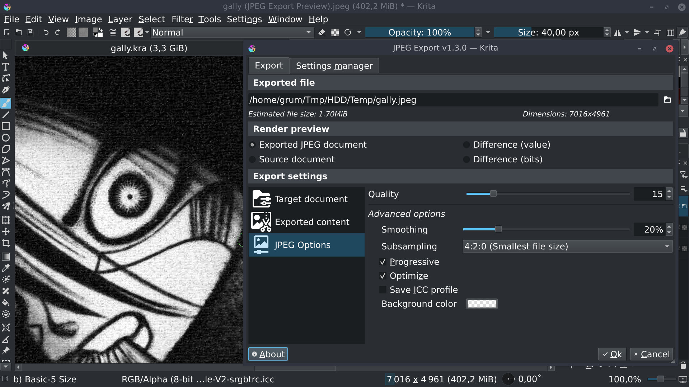
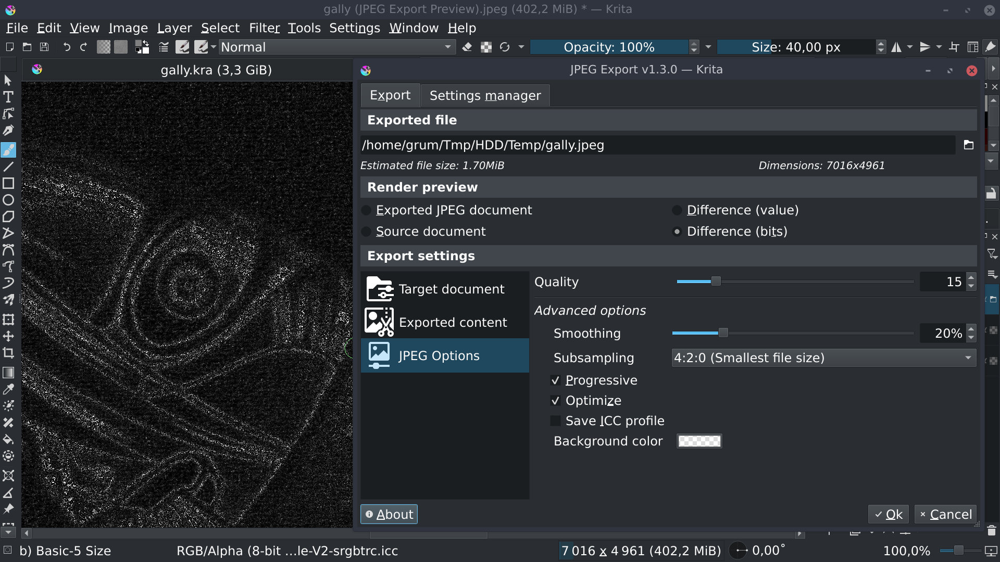

# JPEG Export

A plugin for [Krita](https://krita.org).

## What is JPEG Export?
*JPEG Export* is a Python plugin made for [Krita](https://krita.org) (free professional and open-source painting program).

Krita already allows to export documents as JPEG, but for whom need to find the the right balance between file size and image quality, Krita export functionality doesn't really help.

Basically, the plugin use Krita JPEG export capabilities, but add an improved interface to let user being able to determinate best export options to apply to image.

## Screenshots

*Main interface, final result preview*

*Main interface, difference (bits) result preview*

## Functionalities

Here the list of functionalities:
- Provides most of JPEG export options
- Real time (~1s) export result preview in a Krita view
  - *Allows to zoom and scroll export result preview to check for JPEG compression artifacts*
- Different render modes (Final result, difference with source)
- Ability to export selected area only
- Ability to resize exported document from given dimension constraint
  - Maximum width, Maximum height, Bounding box, Percent of original size
  - Choice of resampling method
- Exported JPEG file size & dimensions provided
- Ability to save/load different settings

## Download, Install & Execute

### Download
+ **[ZIP ARCHIVE - v1.3.0](https://github.com/Grum999/JPEGExport/releases/download/1.3.0/jpegexport.zip)**
+ **[SOURCE](https://github.com/Grum999/JPEGExport)**

### Installation

Plugin installation in [Krita](https://krita.org) is not intuitive and needs some manipulation:

1. Open [Krita](https://krita.org) and go to **Tools** -> **Scripts** -> **Import Python Plugins...** and select the **jpegexport.zip** archive and let the software handle it.
2. Restart [Krita](https://krita.org)
3. To enable *JPEG Export* go to **Settings** -> **Configure Krita...** -> **Python Plugin Manager** and click the checkbox to the left of the field that says **JPEG Export**.
4. Restart [Krita](https://krita.org)

### Execute

Go in **File** menu and select **JPEG Export...** sub-menu

### Tested platforms

Version 1.3.0 requires at least Krita 5.2

## Plugin's life

### What's new?

_[2024-02-27] Version 1.3.0_ [>> Show detailed release content <<](./releases-notes/RELEASE-1.3.0.md)
- Implement *Improve UI*
- Implement *Allow to define target path*
- Implement *Settings manager*
- Implement *Keep window position*
- Fix bug *Save window is behind*

_[2023-05-09] Version 1.2.1_ [>> Show detailed release content <<](./releases-notes/RELEASE-1.2.1.md)
- Fix bug *Krita 5.2.0 Compatibility*

_[2021-12-11] Version 1.2.0_ *[Show detailed release content](./releases-notes/RELEASE-1.2.0.md)*
- Implement *Resize from width or from height*
- Fix bug *Cleanup and missing controls*
- Fix bug *Missing icons*
- Fix bug *Menu not in the right place*

_[2021-11-07] Version 1.1.0_ *[Show detailed release content](./releases-notes/RELEASE-1.1.0.md)*
- Implement *Crop to selection*
- Implement *Resize exported document*
- Implement *Exported document dimensions*
- Improve *Render preview*

_[2021-05-18] Version 1.0.0_ *[Show detailed release content](./releases-notes/RELEASE-1.0.0.md)*
- First implemented/released version!

### Bugs

Probably.

### What’s next?

Currently, nothing :-)
Any idea are welcome.

## License

### *JPEG Export* is released under the GNU General Public License (version 3 or any later version).

*JPEG Export* is free software: you can redistribute it and/or modify it under the terms of the GNU General Public License as published by the Free Software Foundation, either version 3 of the License, or any later version.

*JPEG Export* is distributed in the hope that it will be useful, but WITHOUT ANY WARRANTY; without even the implied warranty of MERCHANTABILITY or FITNESS FOR A PARTICULAR PURPOSE. See the GNU General Public License for more details.

You should receive a copy of the GNU General Public License along with *JPEG Export*. If not, see <https://www.gnu.org/licenses/>.

Long story short: you're free to download, modify as well as redistribute *JPEG Export* as long as this ability is preserved and you give contributors proper credit. This is the same license under which Krita is released, ensuring compatibility between the two.
